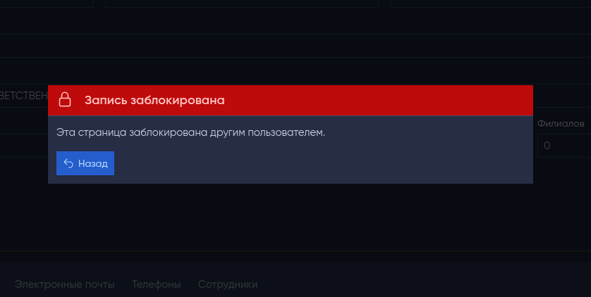
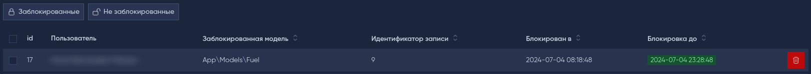

 # Блокировка ресурсов
[![Software License][ico-license]](LICENSE)

[![Laravel][ico-laravel]](Laravel) [![PHP][ico-php]](PHP) 

Добавляет функцию блокировки ресурсов в административную панель MoonShine. Когда пользователь редактирует запись, ресурс блокируется, чтобы другие пользователи не могли одновременно вносить изменения.
> [!CAUTION]
> Версия MoonShine должна быть не ниже 2.18.0
## Содержание
* [Установка](#установка)
* [Использование](#использование)
* [Конфигурация](#конфигурация)
* [Отображение всех блокировок](#отображение-всех-блокировок)
* [Публикация конфигурации и языковых файлов](#публикация-конфигурации-и-языковых-файлов)
* [Лицензия](#лицензия)

## Установка
Команда для установки:
```bash
composer require forest-lynx/moonshine-resource-lock
```
Затем запустите команду установки:
```bash
php artisan resource-lock:install
```
Команда запустит миграции, и предложит опубликовать конфигурационный файл и языковые файлы.

## Использование
Пакет `resource-lock` позволяет заблокировать ресурс и предотвратить его редактирование другими пользователями. В настоящее время блокировка применяется только при редактировании ресурса в режиме отдельной страницы.

##### Активация блокировки ресурса

Для активации блокировки ресурса необходимо добавить в `ModelResource` трейт `WithResourceLock`.

```php
<?php
//...
use ForestLynx\MoonShine\Traits\WithResourceLock;

class PostResource extends ModelResource
{
    use WithResourceLock;
//...
```
Теперь Ваш ресурс может быть заблокирован.

## Конфигурация



##### Время блокировки ресурса.
По умолчанию ресурс будет заблокирован на 10 минут, или до момента его сохранения, в зависимости от того что наступит раньше.
Время блокировки регулируется параметром `lock_time`, который указан в конфигурационном файле, значение указывается в минутах.

##### Отображение информации о пользователе заблокировавшем ресурс

По умолчанию в модальном окне выводится информация о пользователе, который заблокировал доступ к ресурсу.

За вывод информации о пользователе отвечает параметр `show_owner_modal` (который по умолчанию имеет значение `true`) в конфигурационном файле.

В модальном окне отображается только имя пользователя, заблокировавшего доступ к ресурсу. Для отображения иной информации вы можете создать свой класс, который будет унаследован от `ResourceLockOwnerAction`, и зарегистрировать его в конфигурационном файле. Таким образом, вы сможете настроить отображение дополнительных сведений о заблокировавшем доступ пользователе в модальном окне.
Например:
```php
namespace App\Actions;
//...
use ForestLynx\ResourceLock\Actions\ResourceLockOwnerAction;

class CustomActions extends ResourceLockOwnerAction
{
    public function execute(Model|Authenticatable $user): ?string
    {
        return $user->email;
    }
}
```
Затем внести его в конфигурационный файл:
```php
    //...
    -'resource_lock_owner' => \ForestLynx\MoonShine\Actions\ResourceLockOwnerAction::class
    +'resource_lock_owner' => \App\Actions\CustomActions::class
    //...
```

##### Редирект для блокировки ресурса

По умолчанию, когда вы нажимаете кнопку «Назад» в модальном окне заблокированного ресурса, происходит переход на индексную страницу ресурса. Однако вы можете изменить URL страницы редиректа, переопределив метод `getReturnUrlResourceLock` в вашем ресурсе.

```php
    public function getReturnUrlResourceLock(): string
    {
        return 'https://...';
    }
```
##### Отображение информации о заблокированном ресурсе на индексной странице

На индексной странице ресурса по умолчанию отображается информация о том, что доступ к ресурсу был заблокирован другим пользователем. Это отображается в виде специального значка:


Чтобы управлять этим поведением, можно изменить параметр `resource_lock_to_index_page` в файле конфигурации `config/resource-lock.php`.

> [!CAUTION]
> Пока это работает только для ресурсов с отображением через `TableBuilder`.

## Отображение всех блокировок
В этом пакете можно настроить отображение всех заблокированных ресурсов. 



Название ресурса для использования в меню административной панели MoonShine: 

`ForestLynx\MoonShine\Resources\LockResource`.

Удаление записи приводит к разблокировке ресурса.

Чтобы узнать больше о доступных вариантах отображения, обратитесь к документации административной панели [MoonShine](https://moonshine-laravel.com/docs/resource/menu/menu)

## Публикация конфигурации и языковых файлов
Чтобы опубликовать конфигурационный файл запустите команду:
```bash
php artisan vendor:publish --tag=resource-lock-config
```
Подробнее о [конфигурации пакета](#конфигурация).

Для публикации языковых файлов запустите команду:
```bash
php artisan vendor:publish --tag=resource-lock-lang
```
## Лицензия
[Лицензия MIT](LICENSE).


[ico-license]: https://img.shields.io/badge/license-MIT-brightgreen.svg
[ico-laravel]: https://img.shields.io/badge/Laravel-10+-FF2D20?style=for-the-badge&logo=laravel
[ico-php]: https://img.shields.io/badge/PHP-8.1+-777BB4?style=for-the-badge&logo=php

